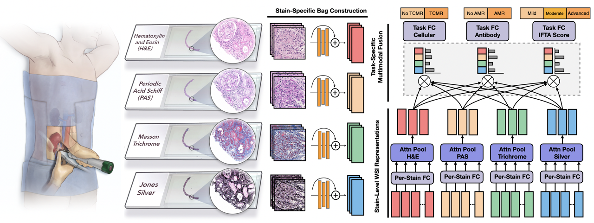
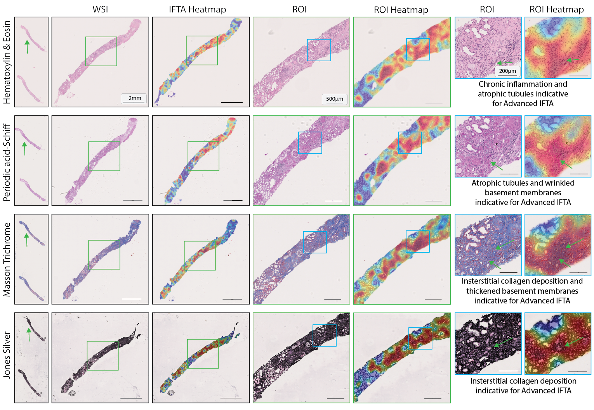

MANTA 
===========
### Multimodal AI for Renal Allograft Biopsy Assessment


MANTA  is  a  high-throughput,  interpretable,  multi-modal, multi-task  framework  that  simultaneously  address the main diagnostic tasks in renal biopsy screening, detection of: T-Cell Mediated Rejection (TCMR), Antibody-Mediated Rejection (AMR) and Intersitial Inflammation and Tubular Atrophy (IFTA)


Due to  the  weakly-supervised  formulation,  the  model  is trained  using  only the  patient  diagnosis as a label, surpassing the needs and limitations of manually annotated diagnostic regions for each task. MANTA takes as input digitized H&E, PAS, Masson Trichrome and Jones Silver stained WSIs, which represent the gold standard in renal biopsy assessment.

\
**Figure 1: Multimodal AI for Nephro-Transplant Assessment (MANTA) workflow.** 
*Figure 1: Multimodal AI for Nephro-Transplant Assessment (MANTA) workflow. Renal core biopsy is performed on the transplanted kidney. The four most common stains used in renal transplant assessment that are created from the biopsy tissue are H&E, PAS, TRI and JMS. Each stain is fed into a separate CNN feature extractor. These features are then fed into our deep learning based, multi-modal, multi-task, multi-label network to assist in diagnosing important renal allograft conditions: TCMR, AMR and IFTA. A hierarchical transformer based multiple instance learning approach is used to enable model training and combine the different modalities. Only patient diagnosis labels and whole slide images are utilized in this pipeline, with no need for slide-level diagnosis or pixel-level annotations of diagnostic biopsy regions. The model assigns attention scores to each image patch, reflecting its relevance for the diagnosis.*


## Pre-requisites:
* Linux (Tested on Ubuntu 18.04)
* NVIDIA GPU (Tested on Nvidia GeForce RTX 3090 TI)
* Python (3.8.5), h5py (2.10.0), matplotlib (3.3.2), numpy (1.22.3), opencv-python (4.4.0.46), openslide-python (1.1.2), pandas (1.1.3), pillow (9.2.0), PyTorch (1.7.1), scikit-learn (0.23.2), scipy (1.5.2), tensorboardx (2.1), torchvision (0.9.0).

### Installation Guide for Linux (using anaconda)
[Installation Guide](https://github.com/mahmoodlab/CLAM/blob/master/docs/INSTALLATION.md)


### Data Preparation
To process the WSI data we used the publicly available [CLAM WSI-analysis toolbox](https://github.com/mahmoodlab/CLAM). First, the tissue regions in each biopsy slide are segmented. Then 256x256 patches (without spatial overlapping) are extracted from the segmented tissue regions at the desired magnification. Consequently, a pretrained truncated ResNet50 or CTransPath is used to encode each raw image patch into a feature vector. In the CLAM toolbox, the features are saved as matrices of torch tensors of size N x 1024, where N is the number of patches from each WSI (varies from slide to slide). The extracted features then serve as input to the network. The following folder structure is assumed for the extracted features vectors:    
```bash
DATA_ROOT_DIR/
    └──features/
        ├── slide_1.pt
        ├── slide_2.pt
        └── ...
```
DATA_ROOT_DIR is the base directory of all datasets (e.g. the directory to your SSD) and features is a folder containing features from each slide stored as a .pt files. Please refer to [CLAM](https://github.com/mahmoodlab/CLAM) for examples on tissue segmentation and feature extraction. 

### Datasets
The model takes as an input list of data in the form of a csv file containing the following columns: **case_id**, **slide_id** and **stain_type**. Each **case_id** is a unique identifier for a patient, while the **slide_id** is a unique identifier for a slide that corresponds to the name of an extracted feature .pt file. In this way, multiple slides from a patient can be easily tracked. The **stain_type** denotes the stain types H&E as 'H+E', PAS as 'PAS', Masson Trichrome as 'Trichrome' and Jones Silver as 'Jones'. The remaining columns in the csv file correspond to the labels stored under the following headers: **label_cell, label_amr,** or **label_ifta**. The labels describe the state of the renal biopsy, used by the multi-task network. We provide dummy examples of the dataset csv files in the **dataset_csv** folder called *KidneyDummy_MTL.csv*. You are free to input the labels for your data in any way as long as you specify the appropriate dictionary maps under the label_dicts argument of the dataset object's constructor (see below). In the multi-task problem, the state of cellular rejection, represented by **label_cell** is encoded as 'no_cell' and 'cell' to express the absence or presence of T-cell mediated rejection. Similarly, the antibody-mediated rejections, specified in **label_amr** are marked as 'no_amr' and 'amr', while ifta scores (**label_ifta**) are specified as 'mild', 'moderate' and 'advanced'.

Dataset objects used for actual training/validation/testing can be constructed using the *Generic_MIL_MTL_Dataset* Class (for the multi-task problem) and *Generic_MIL_Dataset* (for the grading task), defined in *datasets/dataset_mtl.py* and *datasets/dataset_generic.py*. Examples of such dataset objects passed to the models can be found in both **main.py** and **eval.py**: 

```python
elif args.task == 'kidney-mtl':
    args.n_classes=[2,2,3]
    dataset = Generic_MIL_MTL_Dataset(csv_path = 'dataset_csv/KidneyDummy_MTL.csv',
    				data_dir= os.path.join(args.data_root_dir, 'kidney-features'),
                            shuffle = False,
                            seed = args.seed,
                            print_info = True,
                            label_dicts = [{'no_cell':0, 'cell':1},
                                            {'no_amr':0, 'amr':1},
                                            {'mild_ifta':0, 'moderate_ifta':1, 'advanced_ifta':2}],
                            label_cols=['label_cell','label_amr','label_ifta'],
                            patient_strat=False,
                            ignore=[],
                            patient_level = args.patient_level,
                            stain_level = args.stain_level
```
In addition, the following arguments need to be specified:
* csv_path (str): Path to the dataset csv file
* data_dir (str): Path to saved .pt features for the dataset
* label_dicts (list of dict): List of dictionaries with key, value pairs for converting str labels to int for each label column
* label_cols (list of str): List of column headings to use as labels and map with label_dicts

Finally, the user should add this specific 'task' specified by this dataset object to be one of the choices in the --task arguments as shown below:

```python
parser.add_argument('--task', type=str, choices=['kidney-mtl'])
```


###Got up to here
### Training Splits
For evaluating the algorithm's performance, we randomly partitioned our dataset into training, validation and test splits. The split is constructed automatically based on the dataset provided in the csv file. To ensure balance proportion of diagnosis across all splits, an additional csv dataset file can be constructed to account for all the unique combinations of diagnosis (e.g. antibody-mediated rejection alone or mixed antibody-mediated and T-cell mediated rejection). The folder **dataset_csv** contains the dummy csv file: *KidneyDummy_MTLSplit.csv* which illustrates all possible combinations of diagnosis for the renal biopsy. The csv file has to contain the following entries: **case_id**, **slide_id**, **stain_type**, and **label**. The splits are constructed based on the patient's unique identifier specified in **case_id**, so all the slides from the given patient are presented in the same split. The **label** marks the possible diagnosis that should be considered during the split. We consider 12 distinct classes for the MANTA network as shown in the *label_dict* of the **create_splits.py** script:
```python

if args.task == 'kidney-mtl':
    dataset = Generic_WSI_Classification_Dataset(csv_path = 'dataset_csv/KidneySplits_all_slides.csv',
                            shuffle = False,
                            seed = args.seed,
                            print_info = True,
                   	     label_dict = { 'cell_no_amr_mild_ifta':0, 
                                        'cell_amr_moderate_ifta':1 ,
                                        'no_cell_no_amr_mild_ifta':2,
                                        'no_cell_amr_moderate_ifta':3, 
                                        'no_cell_amr_mild_ifta':4, 
                                        'cell_amr_mild_ifta':5,
                                        'cell_no_amr_moderate_ifta':6, 
                                        'no_cell_no_amr_moderate_ifta':7, 
                                        'no_cell_amr_advanced_ifta':8,
                                        'no_cell_no_amr_advanced_ifta':9,
                                        'cell_amr_advanced_ifta':10, 
                                        'cell_no_amr_advanced_ifta':11 },
                            patient_strat= True,
                            ignore=[])
			    
			    

    p_val  = 0.1   # use 10% of data in validation
    p_test = 0.2   # use 20% of data for test-set (held out set), remaining 70% will be used for training
```
where p_val and p_test control the percentage of samples that should be used for validation and testing, respectively. A similar approach is used to split the data for the Grading network (see create_splits.py).

The splits can be then created using the **create_splits.py** script as follows:
``` shell
python create_splits.py --task kidney-mtl --seed 1 --k 1
```
where k is the number of folds. 


### Training
To following command can be used to train the multi-task model, with all stain types using the same feature encoder:
``` shell
CUDA_VISIBLE_DEVICES=0 python main.py --mtl --drop_out --early_stopping --lr 2e-4 --k 1 --label_frac 1 --exp_code kidney_output --bag_loss ce --inst_loss svm --task kidney-mtl --model_type attention_mil --data_root_dir DATA_ROOT_DIR  --subtyping --log_data --patient_level 

```
To utilize fusion with each stain type having its own featre encoder you can use the flag --fusion and specify either 'concat', 'tensor' or 'hierarchical_t'
``` shell
CUDA_VISIBLE_DEVICES=0 python main.py --mtl --drop_out --early_stopping --lr 2e-4 --k 1 --label_frac 1 --exp_code kidney_output --bag_loss ce --inst_loss svm --task kidney_mtl --model_type attention_mil --data_root_dir DATA_ROOT_DIR  --subtyping --log_data --patient_level --stain_level --fusion hierarchical_t
```


The GPU id(s) to be used can be specified using CUDA_VISIBLE_DEVICES, in the example command, the 1st GPU is used. Other arguments such as --drop_out, --early_stopping, --lr, --reg, and --max_epochs can be specified to customize your experiments. 
For information on each argument, see:
``` shell
python main.py -h
```

By default, results will be saved to **results/exp_code** corresponding to the exp_code input argument from the user. If tensorboard logging is enabled (with the argument toggle --log_data), the user can go into the results folder for the particular experiment, run:
``` shell
tensorboard --logdir=.
```
This should open a browser window and show the logged training/validation statistics in real-time.


### Evaluation
User also has the option of using the evaluation script to test the performances of trained models. Examples corresponding to the models trained above are provided below:
``` shell
CUDA_VISIBLE_DEVICES=0 python eval.py --results_dir results --models_exp_code kidney-mtl_100_onebag_s1 --model_type attention_mil --drop_out --k 1--task kidney-mtl --data_root_dir DATA_ROOT_DIR --mtl --model_size big --patient_level

CUDA_VISIBLE_DEVICES=0 python eval.py --results_dir results  --models_exp_code kidney-mtl_concat_100_s1 --model_type attention_mil --drop_out --k 1 --task kidney-mtl --data_root_dir DATA_ROOT_DIR --mtl --model_size small --patient_level --stain_level --fusion concat 
```
For information on each commandline argument, see:
``` shell
python eval.py -h
```


\
**Figure 3: Visualization of attention Heatmaps of TCMR, AMR, IFTA diagnosis from the USA cohort.**  
*The first column is a Hematoxylin & Eosin stained kidney biopsy section representing one of the WSI model
inputs. The three rows represent three independent cases of TCMR, AMR and advanced IFTA. The second
to fourth columns represent the four stains used as input. The last column represents the attention given to
each stain for that case. For each stain in the case, a WSI ROI and the corresponding attention heatmap that
was generated by computing the attention scores for each predicted diagnosis is displayed. The colormap of
the attention heatmaps ranges from red (high-attention) to blue (low-attention). a. TCMR. The high attention
regions in the TCMR case for H&E, PAS and TRI highlight areas of severe interstitial inflammation and
tubulitis indicative of acute T-cell mediated rejection. The JMS stain is non-diagnostic for TCMR. b. AMR.
The high attention regions in the AMR case highlight areas of peritubular capillaritis which is indicative for
antibody mediated rejection. The surrounding blue areas highlight tubules which are non-diagnostic for AMR
diagnosis. c. IFTA. More than 50% of the core was effected, resulting in a diagnosis of advanced IFTA. The
high attention regions of the IFTA case highlight areas of interstitial fibrosis, dense inflammation and tubular
atrophy which is indicative for IFTA.*

\
**Figure 4: Analyzing the model’s predictive basis for Interstitial Fibrosis and Tubular Atrophy.**  
*This case represents advanced interstitial fibrosis and tubular atrophy, with 60-70% of the cortex
affected. The first column are WSIs of the four stains used as input: H&E, PAS, TRI and JMS. The second
column displays a closer view of kidney tissue core by green arrows in the first column. The third column
displays the attention heatmap corresponding to each stain that was generated by computing the attention
scores for each predicted diagnosis. The fourth and fifth columns represent zoom-in-views of the regions of
interest (ROIs) marked by green squares in the second and third column. The fifth and sixth columns represent
zoom-in-views of the regions of interest (ROIs) marked by blue squares in the fourth and fifth columns. The
colormap of the attention heatmaps ranges from red (high-attention) to blue (low-attention)*


## Issues
- Please report all issues on the public forum.

## License
© [Mahmood Lab](http://www.mahmoodlab.org) - This code is made available under the GPLv3 License and is available for non-commercial academic purposes.

## Reference
If you find our work useful in your research or if you use parts of this code please consider citing our paper:

....

```
@article{Sahai2023Manta,
  title={Multimodal AI for Renal Allograft Biopsy Assessment},
  author={Sharifa Sahai ... Astrid Weins, Faisal Mahmood},
  journal={},
  year={2023},
  publisher={}
}
```

